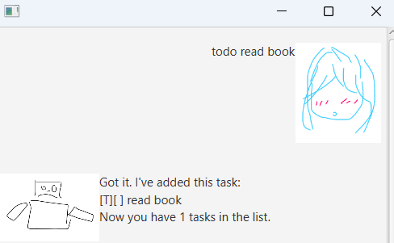

# Stickiem User Guide

An adorable chatbot to help you manage your task, be it todo list, deadlines or events, you can rely on Stickiem to solve those needs!

## Adding ToDos
Add new ToDos to your task list for easy management.

Command: `todo [TASK NAME]`

Example: `todo read book`

Outcome:\

## Adding Deadlines
Add new tasks with deadlines to your task list for easy management.

Command: `deadline [TASK NAME] /by [DATE]`

Example: `deadline read book /by 2001-01-01`

Outcome:\

## Adding Events
Add new event to your task list for easy management.

Command: `event [TASK NAME] /from [DATE] /to [DATE]`

Example: `event read book /from 2001-01-01 /to 2001-02-02`

Outcome:\

## List tasks
List and display your task lists.

Command: `list`

Example: `list`

Outcome:\

## Delete tasks
Delete any task from the task list.

Command: `delete [LIST NUMBER]`

Example: `delete 1`

Outcome:\

## Mark tasks
Mark task from the task list as completed.

Command: `mark [LIST NUMBER]`

Example: `mark 1`

Outcome:\

## Unmark tasks
Unmark task from the task list.

Command: `unmark [LIST NUMBER]`

Example: `unmark 1`

Outcome:\

## Find tasks
Find tasks from task list based on task name.

Command: `find [KEYWORD]`

Example: `find read`

Outcome:\

## Reminder for tasks
Remind users uncompleted tasks and display those tasks.

Command: `reminder`

Example: `reminder`

Outcome:\

## Exit application
Simple command to exit from the application.

Command: `bye`

Example: `bye`

Outcome:\
``Application closes``

